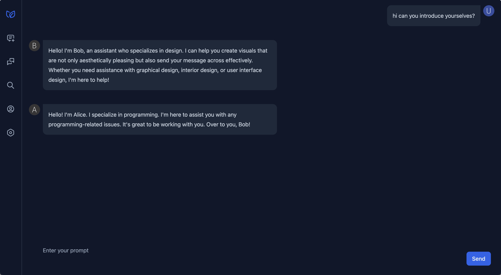
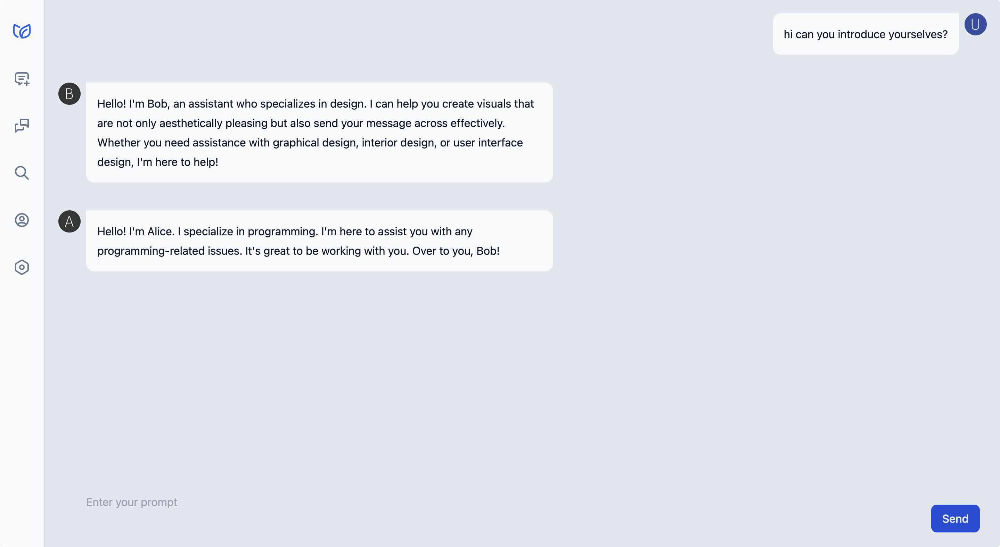

# Chitchai 聊斋

Chitchat with multiple AIs to get more insights!

## Run

0. You'll need Rust, `rustc` `wasm32-unknown-unknown` target and Dioxus CLI.
    1. Install Rust: https://www.rust-lang.org/learn/get-started
    2. Install wasm32-unknown-unknown target: `rustup target add wasm32-unknown-unknown`
    3. Install Dioxus CLI: `cargo install dioxus-cli --locked`
1. Clone this repo
2. Run `dx serve`

### Service Configuration

In the first run, you need to configure a GPT service provider, now OpenAI or Azure OpenAI. The settings panel will show
up automatically. Enter your keys and save. That's all before you can start chatting.

WARNING:
Your API secrets will be stored in your browser's local storage. Please do NOT use `Chitchai` when using a shared
computer.

## Configure Agents

For now, to configure agents, you need to edit [`default_assistants.json`](./default_assistants.json) and then re-run
the server. Each agent configuration has a field of `name` and `instructions`. `instructions` tells an agent what to or
not to do. You can start from the template and customize yours.

## Algorithm

The algorithm is super simple:

1. Give each agent a name and instructions
2. Create a different chat history for each agent
3. Forward chat histories to GPT-4
    * GPT-4 is intelligent enough to distinguish different agents by name and play different roles
    * GPT-3.5 could work sometimes but it often fails to distinguish different agents

### Costs

If you have `N` agents, then basically the cost of each message is `N` times of the cost of a single message.

### Comparison with `AutoGen`

`AutoGen` is comprised of some complicated algorithms and more intricate implementations (kudos), but in its essence,
it's the same as `ChitChai`.

## Build

0. Run `npm install`
1. Run `npx tailwindcss -i src/tailwind_input.css -o ./assets/tailwind.css --watch`
2. Run `dx serve --hot-reload`

## TODOs

Sorted by importance and priority:

- [ ] Hosting it on a website. chitchai.dev is on the way!
- [ ] Add UI for manage agent profiles
- [ ] Add UI for dynamically add agents to a chat
- [ ] Add UIs for all sorts of warnings
- [ ] Filter out `[NONE]` replies
- [ ] Add UIs for user guide
- [ ] i18n
- [ ] Support MiniMax LLM
- [ ] More UI refinements
- [ ] Perhaps a bit more research? Can we do all the stuff `AutoGen` promises?

## Motivation

I found `AutoGen` is quite amazing but the codebase is notoriously complicated for me. I want to build a simpler version
of it. After experimenting a bit, I found GPT-4 is already super intelligent, enough to distinguish different agents
only by name (i.e. the name field in messages that is often ignored by most LLM developers).

Besides, I am also learning building frontends and UIs, so this is a perfect chance.

(PS: I don't want to pay for character.ai for a functionality that can be easily implemented by myself)

## Contributing

Contributions are always welcome! Please open an issue or submit a PR. Also see TODOs above.

## License

The license is and will always be Apache 2.0. See [LICENSE](./LICENSE) for more details. Feel free to fork and use it.

For UIs, we started ours with components from [Langui](langui.dev) which is licensed under MIT License.

## Acknowledgements

Special thanks to GPT-4 and Github Copilot for helping out with the code.